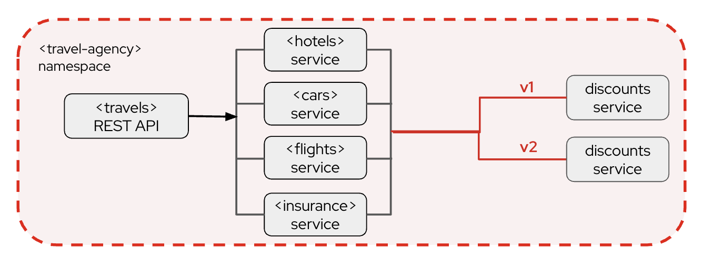
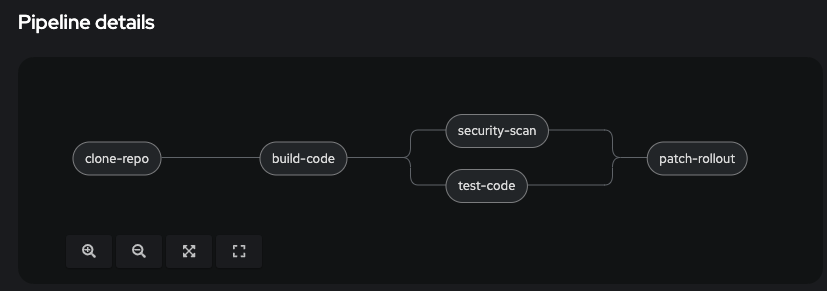

# Argo Rollouts / Service Mesh Demo Artifacts

The resources in this repo are meant to augment the existing RH Demo: 
- `Safeguarding Application Connectivity for the Hybrid Cloud `

Which was a hands-on workshop at Red Hat Summit 2025. The workshop had a canary rollout module, but used a simple script to illustrate the use case.  The resources here are intended to modify that module to use Argo Rollouts instead.



# Instructions

- Install the Openshift Pipelines Operator

- Install the `argo` plugin for kubernetes/oc
  - [link it instructions](https://argo-rollouts.readthedocs.io/en/stable/installation/)

- In the workshop, be sure to complete `module 1`, and `module 2` up to the section `Activity: Shape Traffic with OpenShift Service Mesh`

- Delete the deployment for `discounts`

```bash
oc delete deployment discounts-v1
```

- Replace the deployment with the Rollout CRD

```bash
 oc apply -f k8/ArgoRollouts-ServiceMesh.yaml
 ```

*Note*: This creates the following resources:
```
rolloutmanager.argoproj.io/cluster 
rollout.argoproj.io/discounts 
service/canary 
virtualservice.networking.istio.io/discounts 
```

- create the custom tasks and pipeline resources

``` 
oc apply -f k8/pipeline.yaml -n travel-agency
oc apply -f k8/task.yaml -n travel-agency 
```

*Note*: This creates the following resources:
```
pipeline.tekton.dev/demo-rollout-pipeline 

task.tekton.dev/mock-task 
task.tekton.dev/patch-rollout 
```

- View the created pipline in the `travel-agency` namespace


*Note*: The first 4 pipeline tasks don't actually do anyhthing except log a message, they are meant to illustrate a close to real world CI pipeline.

- Inspect the task `patch-rollout`. Note that it looks for the tag of the deployed container, and flips it to either `v1` or `v2` in the Rollout CRD based on what is already deployed.

- In a terminal window, run the script:
```
sh scripts/monitor.sh
```

*Example output*:
```
Name:            discounts
Namespace:       travel-agency
Status:          ✔ Healthy
Strategy:        Canary
...
Images:          quay.io/llevy/demo_travels_discounts:v2 (stable)
Replicas:
...
NAME                                 KIND        STATUS        AGE  INFO
⟳ discounts                          Rollout     ✔ Healthy     43h  
├──# revision:39                                                    
│  └──⧉ discounts-c6c6499d           ReplicaSet  ✔ Healthy     19h  stable
│     ├──□ discounts-c6c6499d-szxwh  Pod         ✔ Running     36m  ready:2/2
│     ├──□ discounts-c6c6499d-vcjt4  Pod         ✔ Running     36m  ready:2/2
│     ├──□ discounts-c6c6499d-k6qls  Pod         ✔ Running     35m  ready:2/2
│     ├──□ discounts-c6c6499d-sh4w7  Pod         ✔ Running     35m  ready:2/2
│     ├──□ discounts-c6c6499d-s2qtl  Pod         ✔ Running     34m  ready:2/2
│     ├──□ discounts-c6c6499d-sz4l4  Pod         ✔ Running     34m  ready:2/2
│     ├──□ discounts-c6c6499d-d4458  Pod         ✔ Running     34m  ready:2/2
│     ├──□ discounts-c6c6499d-mxx4w  Pod         ✔ Running     34m  ready:2/2
│     ├──□ discounts-c6c6499d-qpkzv  Pod         ✔ Running     34m  ready:2/2
│     └──□ discounts-c6c6499d-zxm5z  Pod         ✔ Running     34m  ready:2/2


discounts: 100%
canary: 0%
```

*Note*: This requires the `argo` plugin for kubernetes/oc
[link it instructions](https://argo-rollouts.readthedocs.io/en/stable/installation/)

- To initiate a canary rollout, create a pipelinerun:

```
oc apply -f k8/pipeline-run.yaml -n travel-agency
```

  - This is the prefered method for the initial pipelinerun, as it contains the annotation:

  ```
  annotations:
    sidecar.istio.io/inject: "false"
  ```
  - You can rerun from the web consol for subsequent pipeline runs. 
  - You may create a new run from the web-console, just note that it runs in the `travel-agency` namespace and will get a proxy sidecar. The annotation in the yaml prevents this. There is no harm in running either way.

- When the rollout starts, it will pause at `80`/`20`. This is a good time to observe the traffic split in Kiali, as well as the curent state of the VirtualService to show the updated traffic weights.

- Resume and complete/promote the rollout by running the script:
```
sh scripts/promote.sh   
```

*Example output*:
```
oc argo rollouts promote discounts -n travel-agency
rollout 'discounts' promoted
```
  - This will unpause the rollout to completion